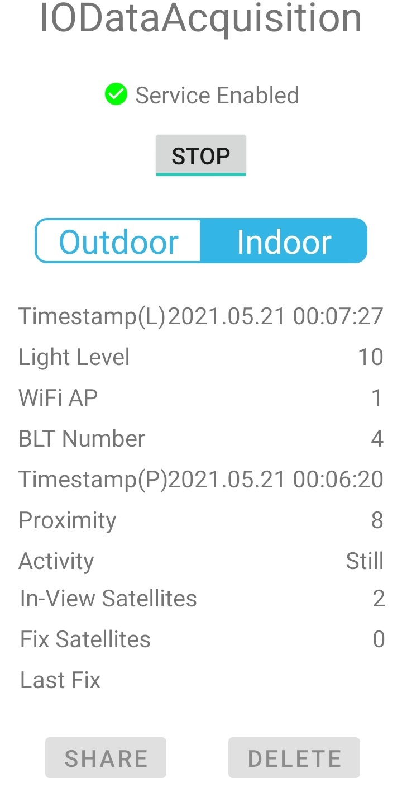

# IODataAcquisition
### IODataAcquistion Application
In order acquire a dataset -to train a neural network able to classify if the users is indoor or outdoor- this application was developed. In particular, this Android application acquire and store in a file called _data-collected.csv_ the following data :
* Values detected by the proximity sensor
* Values detected by the light sensor
* Number of Wi-Fi Access Point available
* Number of Bluetooth devices available
* Number of GPS in the line of sight 
* Number of fixed GPS
* Type of the activity performed by the user exploiting the Google Activity Recognition API

In order to work properly the following permission must be granted to the IODataAcquisition application:
* ACCESS_FINE_LOCATION
* ACCESS_BACKGROUND_LOCATION
* ACTIVITY_RECOGNITION


Moreover in order to work properly GPS and bluetooth must be active, but the app don't have to be in foreground. The application interface is the following: </br>
<p align="center">
  
</p>

At the top of the application there is the button **START** that can be used in order to start the data acquisition, and the radio button **INDOOR** and **OUTDOOR** that can be used in order to label the data acquired by the sensors. The list of the data acquired from the sensors is displayed in order to give a glance to whats going on. At the application bottom there are two different buttons: **SHARE** in order to ease the recorded data sharing and **DELETE** that instead can be used in order to delete all the data recorded up to now. 

### Data preprocessing and Neural Network Deployment 

#### Folder organization 

```
  📂 nn 
  |
  |
  +--- prepare.ipynb is the Jupyter Notebook be used in order to prepocess the .csv file in the dataset folder.
  |
  |
  +--- nntrain.ipynb is the Google Colab Notebook used to train the Neural Network with Tensorflow.  
  |
  |
  +--- 📂 datasets
        |
        |
        +---*.csv
```
The execution of the _prepare.ipynb_ outputs two aggregated csv file one called _preprocessed_data.csv_ and another called _metadata.csv_. Both of them consitutes the input for the _nntrain.ipynb_ notebook within which the neural network is deployed.
#### How data are preprocessed?
In order to create the feature vector
